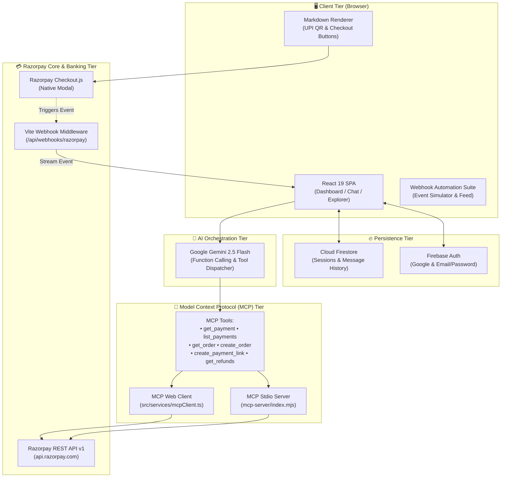
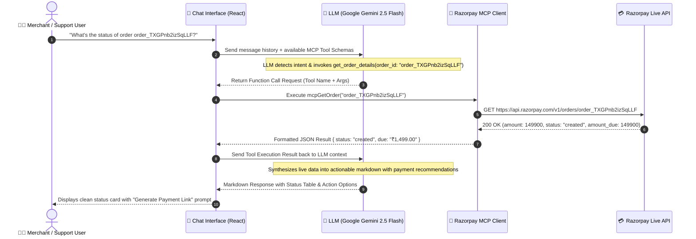
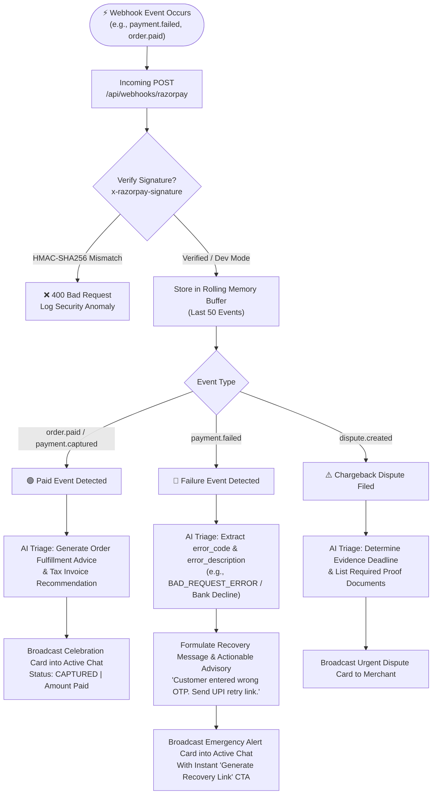
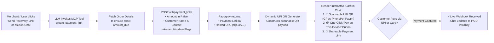
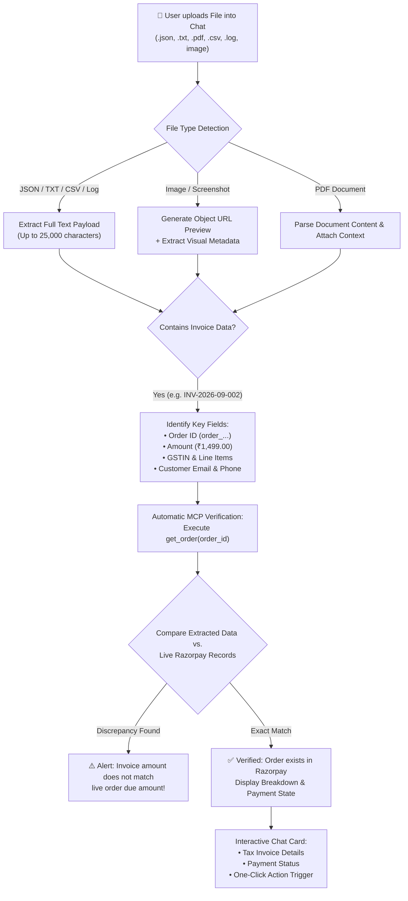
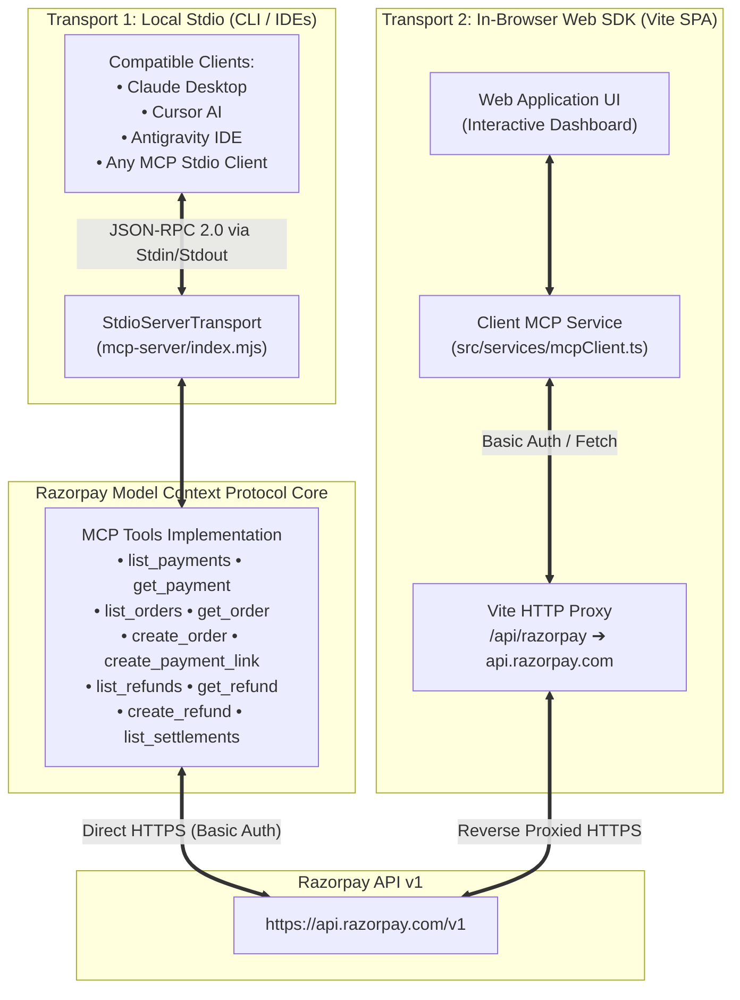

<div align="center">

# ⚡ Razorpay MCP Agent
### Autonomous AI Merchant Operations, Live Tool Calling & Real-Time Payment Intelligence

[](https://react.dev/)
[](https://www.typescriptlang.org/)
[](https://vitejs.dev/)
[](https://tailwindcss.com/)
[](https://modelcontextprotocol.io/)
[](https://razorpay.com/)
[](https://deepmind.google/technologies/gemini/)
[](https://firebase.google.com/)
[](https://greensock.com/gsap/)

<br />

**Razorpay MCP Agent** is an enterprise-grade, autonomous payment operations and merchant support platform. Built on the open **Model Context Protocol (MCP)** specification, it seamlessly interfaces **Google Gemini 2.5 Flash** with **Razorpay's Live REST API**. 

From autonomous payment investigations and failure code diagnosis, to instant order creation, dynamic UPI QR generation, scannable in-chat checkout, and real-time HMAC-verified webhook triage — Razorpay MCP Agent transforms payment workflows into conversational intelligence.

[Explore Features](#-key-features) • [Architecture Diagrams](#-system-architecture) • [Flowcharts](#-workflow-flowcharts) • [MCP Tool Catalog](#-mcp-tool-catalog) • [Getting Started](#-getting-started) • [MCP Configuration](#-running-the-mcp-server)

---

</div>

## 📑 Table of Contents

- [Overview](#-overview)
- [System Architecture](#-system-architecture)
- [Workflow Flowcharts](#-workflow-flowcharts)
  - [1. High-Level System Architecture](#1-high-level-system-architecture)
  - [2. Conversational MCP Tool-Calling Loop](#2-conversational-mcp-tool-calling-loop)
  - [3. Real-Time Webhook Ingestion & AI Triage Pipeline](#3-real-time-webhook-ingestion--ai-triage-pipeline)
  - [4. Payment Recovery & Dynamic UPI QR Code Generation](#4-payment-recovery--dynamic-upi-qr-code-generation)
  - [5. Multimodal Invoice & Evidence Ingestion Engine](#5-multimodal-invoice--evidence-ingestion-engine)
  - [6. Dual-Transport MCP Server Architecture](#6-dual-transport-mcp-server-architecture)
- [Key Features](#-key-features)
  - [Autonomous AI Engine (Dual LLM Core)](#1-autonomous-ai-engine-dual-llm-core)
  - [Live Model Context Protocol (MCP) Protocol](#2-live-model-context-protocol-mcp-protocol)
  - [Real-Time Webhook Automation & Instant Triage](#3-real-time-webhook-automation--instant-triage)
  - [In-Chat Razorpay Checkout & Dynamic UPI QRs](#4-in-chat-razorpay-checkout--dynamic-upi-qrs)
  - [Multimodal Evidence & Document Analysis](#5-multimodal-evidence--document-analysis)
  - [Live MCP Data Explorer](#6-live-mcp-data-explorer)
  - [Firebase Cloud Persistence](#7-firebase-cloud-persistence)
- [MCP Tool Catalog](#-mcp-tool-catalog)
- [Project Directory Structure](#-project-directory-structure)
- [Getting Started](#-getting-started)
  - [Prerequisites](#prerequisites)
  - [Installation](#installation)
  - [Environment Configuration](#environment-configuration)
  - [Running the Application](#running-the-application)
- [Running the MCP Server (Stdio Mode)](#-running-the-mcp-server-stdio-mode)
  - [Claude Desktop Configuration](#claude-desktop-configuration)
  - [Cursor / Antigravity IDE Configuration](#cursor--antigravity-ide-configuration)
- [Testing & Automation Scripts](#-testing--automation-scripts)
- [Security & Compliance](#-security--compliance)
- [Author & Credits](#-author--credits)

---

## 🌟 Overview

Operating modern payment gateways demands constant vigilance: tracking down failed transactions, diagnosing esoteric bank decline codes, responding to chargeback disputes before tight deadlines, refunding unhappy customers, and generating checkout links.

**Razorpay MCP Agent** solves this by establishing a direct bridge between conversational AI agents and Razorpay:

1. **Zero Guesswork / No Mock Data:** Connects directly to official Razorpay endpoints (`/v1/payments`, `/v1/orders`, `/v1/refunds`, `/v1/settlements`, `/v1/payment_links`).
2. **Standardized Protocol:** Leverages the open **Model Context Protocol (MCP)** specification so any MCP-compliant client (web UI, CLI, Claude Desktop, Cursor, Antigravity) can manage payments identically.
3. **Automated Cart Recovery:** Detects payment failure webhooks in milliseconds, consults the AI engine to generate customer-friendly retry notifications, and auto-spins UPI QR codes and payment links.
4. **Interactive In-Chat Execution:** Users can inspect orders, view real-time breakdown tables, click to open the official Razorpay Checkout modal without leaving the chat, or scan dynamically generated UPI QR codes on their mobile phones.

---

## 🏛️ System Architecture

The application is structured into four primary tiers:

```
┌─────────────────────────────────────────────────────────────────────────────┐
│                           PRESENTATION LAYER                                │
│   React 19 + TypeScript + Vite + Tailwind CSS v4 + Shadcn UI + GSAP        │
│   • Interactive Chat Interface      • Live MCP Data Explorer                │
│   • Webhook Automation Suite        • Dynamic UPI QR & Checkout Modal       │
└───────────────────────┬─────────────────────────────┬───────────────────────┘
                        │                             │
                        ▼                             ▼
┌─────────────────────────────────┐       ┌───────────────────────────────────┐
│     AI ORCHESTRATION LAYER      │       │     CLOUD PERSISTENCE LAYER       │
│  • Google Gemini 2.5 Flash      │       │  • Firebase Authentication        │
│  • Dynamic Function Calling     │       │  • Cloud Firestore Sessions       │
│  • Real-Time Tool Execution     │       │  • Real-Time Chat Synchronization │
└───────────────┬─────────────────┘       └───────────────────────────────────┘
                │
                ▼
┌─────────────────────────────────────────────────────────────────────────────┐
│                     MODEL CONTEXT PROTOCOL (MCP) LAYER                      │
│   • Stdio Transport MCP Server (@modelcontextprotocol/sdk)                  │
│   • In-Browser MCP Client with Vite Reverse Proxy (/api/razorpay)           │
│   • 8+ Standardized Tools (Payments, Orders, Refunds, Links, Settlements)   │
└───────────────────────────────────────┬─────────────────────────────────────┘
                                        │
                                        ▼
┌─────────────────────────────────────────────────────────────────────────────┐
│                          RAZORPAY INTEGRATION TIER                          │
│   • Live Razorpay REST API (v1)      • Webhook Ingestion Engine             │
│   • Standard Checkout.js Modal       • HMAC-SHA256 Signature Verification   │
└─────────────────────────────────────────────────────────────────────────────┘
```

---

## 📊 Workflow Flowcharts

### 1. High-Level System Architecture



---

### 2. Conversational MCP Tool-Calling Loop



---

### 3. Real-Time Webhook Ingestion & AI Triage Pipeline



---

### 4. Payment Recovery & Dynamic UPI QR Code Generation



---

### 5. Multimodal Invoice & Evidence Ingestion Engine



---

### 6. Dual-Transport MCP Server Architecture



---

## 🚀 Key Features

### 1. Autonomous AI Engine (Google Gemini 2.5 Flash)
- **Google Gemini 2.5 Flash:** High-precision multimodal model capable of analyzing structured JSON, invoice images, and payment logs with zero latency.
- **Native MCP Tool Declarations:** Direct function calling integration with Razorpay REST endpoints.
- **Autonomous Reasoning & Triage:** Analyzes webhook failures, auto-generates recovery payment links and dynamic UPI QR codes.

### 2. Live Model Context Protocol (MCP) Protocol
- **Official Specification Compliant:** Implements `@modelcontextprotocol/sdk` v1.30.
- **Stdio Server & In-Browser Client:** Offers dual execution paths for both standalone desktop AI agents and the web dashboard.
- **100% Real Gateway Communication:** No simulated or mock payment records; queries live Razorpay Test or Production keys directly.

### 3. Real-Time Webhook Automation & Instant Triage
- **Built-in HTTP Webhook Ingestion:** Vite middleware listens on `/api/webhooks/razorpay` to capture incoming events.
- **HMAC-SHA256 Cryptographic Verification:** Validates `x-razorpay-signature` against your webhook secret to prevent tampering.
- **Instant Chat Push Notification:** Real-time poller streams payment confirmations, failure alerts, and dispute warnings into the active chat session.
- **AI-Powered Triage Engine:** Automatically analyzes failure reasons (`BAD_REQUEST_ERROR`, OTP timeouts, insufficient funds) and prepares customer-ready recovery messages.
- **Live Simulator:** Built-in dashboard suite to simulate `payment.failed`, `order.paid`, `dispute.created`, and `refund.processed` events with one click.

### 4. In-Chat Razorpay Checkout & Dynamic UPI QRs
- **Zero-Redirect Modal:** Standard Razorpay Checkout.js opens natively directly on top of the dashboard.
- **Dynamic Scannable UPI QR:** Automatically embeds scannable UPI QR codes in AI responses using standard QR APIs — compatible with Google Pay, PhonePe, Paytm, and BHIM.
- **Interactive Markdown Renderer:** Renders custom payment action buttons inside AI responses that invoke native payment dialogs.

### 5. Multimodal Evidence & Document Analysis
- **Drag-and-Drop Ingestion:** Accepts invoices, receipts, error logs, and transaction screenshots (`.json`, `.txt`, `.pdf`, `.png`, `.jpg`, `.csv`).
- **Context Injection:** Extracts up to 25,000 characters of invoice data and injects it into the LLM conversation stream.
- **Automatic Reconciliation:** Matches invoice order IDs and customer amounts against live Razorpay records to detect unpaid balances or overcharges.

### 6. Live MCP Data Explorer
- **Visual Gateway Inspector:** View live payments, orders, and refunds in real time.
- **Interactive Quick-Actions:** One-click copy for Payment and Order IDs, or quick-query ("Ask AI about this payment").
- **Key Manager Modal:** Safely configure or clear Razorpay Key ID and Secret with instant validation.

### 7. Firebase Cloud Persistence
- **Firebase Authentication:** Secure authentication via Google Sign-In or Email/Password.
- **Real-Time Cloud Firestore:** All chat sessions, message histories, uploaded evidence, and notes are synced across devices in real time.
- **Seamless LocalStorage Migration:** Automatically migrates legacy browser sessions into Firestore upon authentication.

---

## 🛠️ MCP Tool Catalog

The Razorpay MCP implementation exposes the following production tools:

| Tool Name | Scope | Description | Key Parameters |
|---|---|---|---|
| `list_payments` | Payments | Fetch recent payment transactions directly from Razorpay. | `status` (all, captured, failed, refunded), `limit` |
| `get_payment` | Payments | Retrieve complete details for a specific payment ID. | `payment_id` (`pay_...`) |
| `list_orders` | Orders | List merchant orders including amounts paid, due, and receipt numbers. | `limit` |
| `get_order` | Orders | Fetch complete status and payment attempts for a specific order. | `order_id` (`order_...`) |
| `create_order` | Orders | Create a new live unpaid order on Razorpay. | `amount` (in INR), `receipt`, `description` |
| `create_payment_link` | Links / UPI | Generate a payment link and dynamic scannable UPI QR code. | `order_id`, `amount`, `description`, `customer_name` |
| `list_refunds` | Refunds | List refunds with payment references and processing speed. | `payment_id`, `limit` |
| `get_refund` | Refunds | Fetch details of a specific refund ID. | `refund_id` (`rfnd_...`) |
| `create_refund` | Refunds | Issue a full or partial refund for a captured payment. | `payment_id`, `amount` (paise), `reason` |
| `list_settlements` | Settlements | Retrieve merchant bank payout settlements and UTR numbers. | `limit` |
| `get_disputes` | Disputes | Check for open customer chargebacks or disputes. | None |

---

## 📁 Project Directory Structure

```
razorpay-agent/
├── .agents/
│   ├── mcp_config.json                 # Antigravity IDE MCP Server Configuration
│   └── plugins/razorpay/
│       ├── mcp_config.json             # Namespaced plugin configuration
│       └── plugin.json                 # Razorpay plugin manifest
├── mcp-server/
│   └── index.mjs                       # Standalone Node.js MCP Server (Stdio Transport)
├── public/
│   ├── razorpay.svg                    # Razorpay brand assets
│   └── Untitled design (14).svg
├── scripts/
│   └── create_test_orders.mjs          # CLI script to generate live unpaid test orders
├── src/
│   ├── components/
│   │   ├── ui/                         # Shadcn UI component library (Buttons, Dialogs, etc.)
│   │   ├── MarkdownRenderer.tsx        # Markdown renderer with live UPI QR & Payment buttons
│   │   ├── theme-provider.tsx          # Dark / Light theme provider
│   │   ├── WebhookAutomationModal.tsx  # Webhook automation drawer modal
│   │   └── WebhookAutomationPage.tsx   # Dedicated full-page Webhook Ingestion & Triage Suite
│   ├── lib/
│   │   └── firebase.ts                 # Firebase app, auth, and firestore initialization
│   ├── pages/
│   │   ├── Auth.tsx                    # Animated split-screen sign-in / sign-up (GSAP)
│   │   ├── Dashboard.tsx               # Main application dashboard, chat, and MCP explorer
│   │   └── Landing.tsx                 # Clean product landing page with quick-start action
│   ├── services/
│   │   ├── gemini.ts                   # Google Gemini Flash client with function declarations
│   │   ├── firebaseChat.ts             # Firestore session sync & migration utilities
│   │   ├── mcpClient.ts                # In-browser MCP client calling Razorpay REST API
│   │   ├── razorpayCheckout.ts         # Razorpay Checkout.js wrapper with webhook triggers
│   │   └── webhookAutomation.ts        # Webhook ingestion, signature verification & AI triage
│   ├── App.tsx                         # Client-side routing configuration
│   ├── index.css                       # Tailwind CSS v4 design tokens & base typography
│   └── main.tsx                        # Application mount entrypoint
├── .env.example                        # Template for environment credentials
├── index.html                          # HTML template containing Razorpay checkout script
├── mcp_config.json                     # Root MCP configuration for desktop clients
├── package.json                        # NPM scripts and project dependencies
├── tsconfig.json                       # TypeScript compiler configuration
└── vite.config.ts                      # Vite configuration with webhook receiver & reverse proxies
```

---

## 🏁 Getting Started

### Prerequisites
- **Node.js**: v18.0.0 or higher
- **npm** or **pnpm**
- A **Razorpay Account** (Test Mode credentials work out of the box)
- *(Optional)* **Google Gemini API Key** for LLM orchestration

### Installation

1. **Clone the repository:**
   ```bash
   git clone https://github.com/PandeyAnukrati/razorpay-mcp-agent.git
   cd razorpay-mcp-agent
   ```

2. **Install dependencies:**
   ```bash
   npm install
   ```

### Environment Configuration

Create a `.env` file in the project root:

```bash
cp .env.example .env
```

Populate the required credentials:

```env
# Razorpay Credentials (from https://dashboard.razorpay.com/app/keys)
RAZORPAY_KEY_ID=rzp_test_YOUR_KEY_ID
RAZORPAY_KEY_SECRET=YOUR_KEY_SECRET

# Vite Client Credentials
VITE_RAZORPAY_KEY_ID=rzp_test_YOUR_KEY_ID
VITE_RAZORPAY_KEY_SECRET=YOUR_KEY_SECRET

# Webhook Secret (Matches the secret configured in Razorpay Webhooks dashboard)
VITE_RAZORPAY_WEBHOOK_SECRET=rzp_whsec_auto_998877

# AI Orchestration Keys
VITE_GEMINI_API_KEY=AIzaSyYOUR_KEY
```

> **Note:** You can also dynamically configure or override your Razorpay keys directly from the web interface using the **MCP API Keys** button in the dashboard top bar.

### Running the Application

Start the local development server:

```bash
npm run dev
```

The application will start on `http://localhost:5173`. Open this URL in your browser to access the dashboard.

---

## 💻 Running the MCP Server (Stdio Mode)

The project includes an official standalone Model Context Protocol server that communicates via **Standard I/O (`stdio`)**. You can connect it to external desktop AI agents like **Claude Desktop**, **Cursor**, or **Antigravity IDE**.

### Test the MCP Server directly:
```bash
npm run mcp:server
```

### Claude Desktop Configuration
Add the following to your `claude_desktop_config.json` (located at `%APPDATA%\Claude\claude_desktop_config.json` on Windows or `~/Library/Application Support/Claude/claude_desktop_config.json` on macOS):

```json
{
  "mcpServers": {
    "razorpay": {
      "command": "node",
      "args": ["c:/Users/Shreyansh/Desktop/razorpay-agent/mcp-server/index.mjs"],
      "env": {
        "RAZORPAY_KEY_ID": "rzp_test_YOUR_KEY_ID",
        "RAZORPAY_KEY_SECRET": "YOUR_KEY_SECRET"
      }
    }
  }
}
```

### Cursor / Antigravity IDE Configuration
The repository includes an active `.agents/mcp_config.json` configured as follows:

```json
{
  "mcpServers": {
    "razorpay": {
      "command": "node",
      "args": ["./mcp-server/index.mjs"],
      "env": {
        "NODE_ENV": "development"
      }
    }
  }
}
```

Once loaded, your AI assistant can directly call `list_payments`, `get_payment`, `create_order`, and `create_payment_link` autonomously.

---

## 🧪 Testing & Automation Scripts

### 1. Generating Live Unpaid Test Orders
To test payment link creation, UPI QR generation, and invoice reconciliation with real data, run the bundled test order creation script:

```bash
node scripts/create_test_orders.mjs
```

This will create 3 live test orders directly in your Razorpay account with distinct customer names and amounts (₹1,299.00, ₹2,499.00, ₹4,999.00).

### 2. Testing Webhook Automations
1. Open the dashboard and navigate to the **Webhook Engine** tab.
2. Click **Simulate Failed Payment** to trigger an instantaneous failure payload.
3. Observe the AI triage engine analyze the error code and push a payment recovery notification into your active chat session.
4. Click **Simulate Order Paid** to verify signature validation and watch the instant order confirmation card appear in chat.

---

## 🔒 Security & Compliance

- **HMAC SHA-256 Webhook Verification:** Prevents unauthorized replay attacks by verifying `x-razorpay-signature` against your shared secret.
- **Client-Side Secret Shielding:** Vite proxy routes sensitive API calls (`/api/razorpay`) to preserve key safety without exposing credentials in client-side code.
- **Zero Mock Fallback Mode:** Prevents misleading operations by enforcing hard validation on Razorpay API keys before processing financial operations.
- **Sandboxed Execution:** Supports Razorpay Test Mode keys (`rzp_test_...`) for risk-free simulation before live deployment.

---

## 👩‍💻 Author & Credits

- **Author & Developer:** [Anukrati Pandey](https://github.com/PandeyAnukrati)
- **Repository:** [PandeyAnukrati/razorpay-mcp-agent](https://github.com/PandeyAnukrati/razorpay-mcp-agent)
- **Built With:** [Razorpay API](https://razorpay.com/docs/api/), [Model Context Protocol](https://modelcontextprotocol.io/), [Google Gemini](https://deepmind.google/technologies/gemini/), [Vite](https://vitejs.dev/), [Tailwind CSS](https://tailwindcss.com/)

---

<div align="center">

Made with ❤️ for merchants, support engineers, and AI developers.

⭐ **Star this repository if you find it helpful!**

</div>